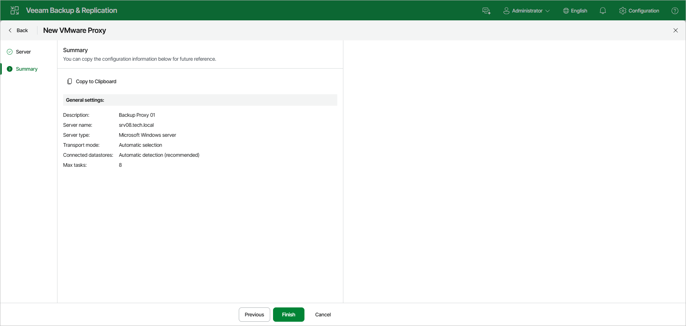

# Step 3. Finish Working with Wizard

At the Summary step of the wizard, review details of the VMware backup proxy. Then click Finish to complete the procedure of adding the VMware backup proxy to the backup infrastructure. Veeam Backup & Replication will install and configure all required components.

