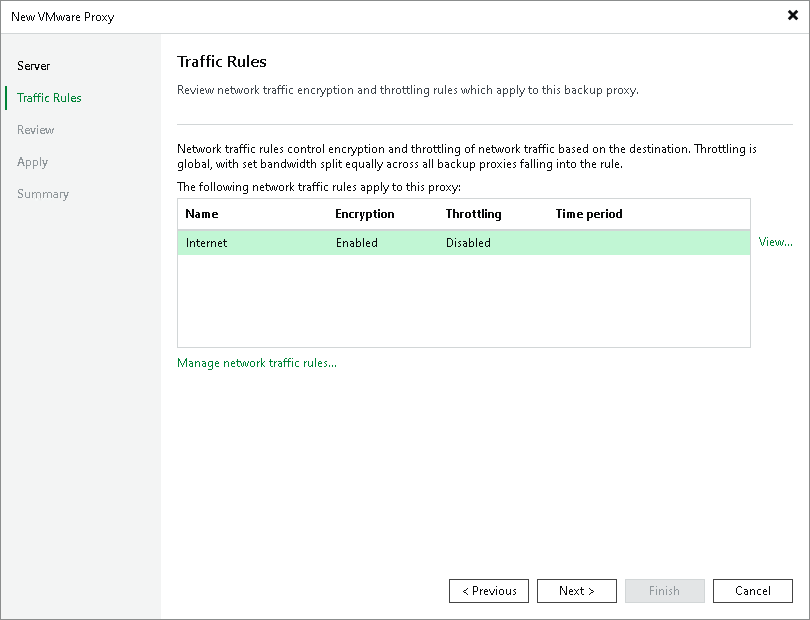

# Step 4. Configure Traffic Rules

At the Traffic Rules step of the wizard, configure network traffic rules. These rules help you throttle and encrypt traffic transferred between backup infrastructure components. For more information, see [Configuring Network Traffic Rules](network_rules.md).

The list of network traffic rules contains only the rules that are applicable to the VMware backup proxy: its IP address falls into the IP range of the rule.

To view rule settings:

1. Select a rule in the list.
2. Click View on the right of the rule list.

You can also modify network traffic settings:

1. Click Manage network traffic rules link at the bottom of the wizard.
2. In the opened window, you will see all global network traffic rules.
3. Select the rule that you want to modify and click Edit.

