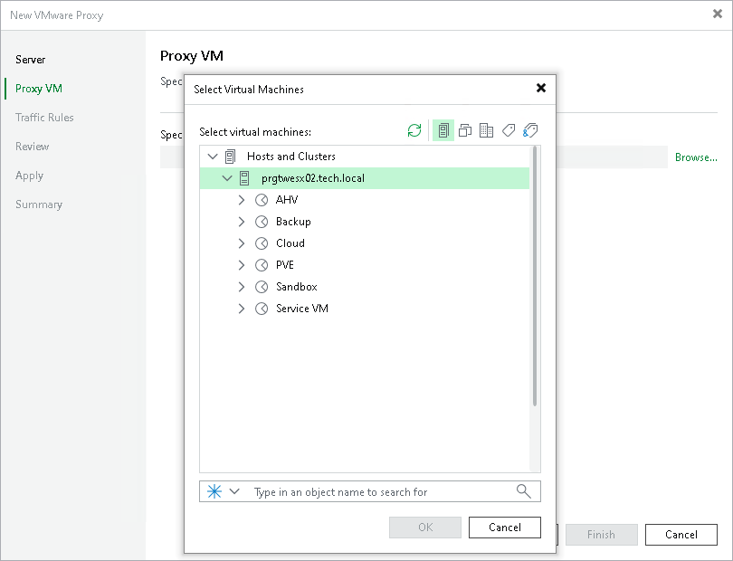

# Step 3. Select Proxy VM

The Proxy VM step will appear if all of the following conditions are met:

* You have selected a Linux server at the [Server](vmware_proxy_server.md) step of the wizard.
* You have selected the Virtual Appliance transport mode without the Failover to network mode if primary mode fails, or is unavailable check box at the [Server](vmware_proxy_server.md) step of the wizard.
* Veeam Backup & Replication cannot identify the selected VM: for example, there are two VMs with the same BIOS UUID or BIOS UUID is not specified.

To select a VM from the virtual infrastructure:

1. At the Proxy VM step of the wizard, click the Browse button.
2. In the Select Virtual Machine window, select a VM.

