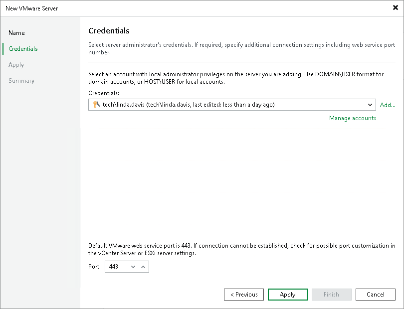

# Step 3. Specify Credentials

In this article

At the Credentials step of the wizard, specify credentials and port settings for the VMware vSphere server.

1. From the Credentials list, select credentials with the required permissions. For more information, see [Permissions](required_permissions.md#rphost).

If you have not set up credentials beforehand, click the Manage accounts link or click Add on the right to add the credentials. For more information, see [Credentials Manager](credentials_manager.md).

1. By default, Veeam Backup & Replication uses port 443 to communicate with vCenter Servers and ESXi hosts. If a connection with the vCenter Server or ESXi host over this port cannot be established, you can customize the port number in vCenter Server/ESXi host settings and specify the new port number in the Port field.

1. When you add a vCenter Server or ESXi host, Veeam Backup & Replication saves to the configuration database a thumbprint of the TLS certificate installed on the vCenter Server or ESXi host. During every subsequent connection to the server, Veeam Backup & Replication uses the saved thumbprint to verify the server identity and avoid the man-in-the-middle attack. For details on managing TLS Certificates, see [Backup Server Certificate](backup_server_certificate.md).

If the certificate installed on the server is not trusted, Veeam Backup & Replication displays a warning.

+ To view detailed information about the certificate, click View.

+ If you trust the server, click Continue.

+ If you do not trust the server, click Cancel. Veeam Backup & Replication will display an error message, and you will not be able to connect to the server.

|  |
| --- |
| Note |
| When you update a certificate on a server, this server becomes unavailable in the Veeam Backup & Replication console. To make the server available again, acknowledge the new certificate at the Credentials step of the [Edit Server](edit_server.md) wizard. |

Page updated 8/6/2025

Page content applies to build 13.0.1.1071
