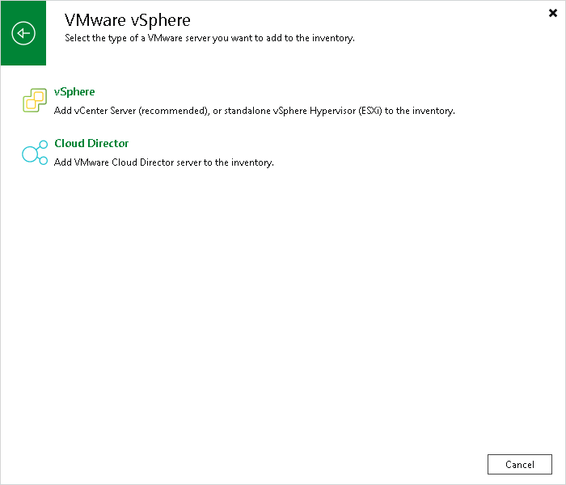

# Step 1. Launch New VMware Server Wizard

To launch the New VMware Server wizard, do one of the following:

* Open the Backup Infrastructure view. In the [inventory pane](vbr_ui.md), select the Managed Servers node and click Add Server on the ribbon or right-click the Managed Servers node and select Add Server. In the Add Server window, click Virtualization Platforms > VMware vSphere > vSphere.
* Open the Inventory view, in the [inventory pane](vbr_ui.md) select the VMware vSphere node and click Add Server on the ribbon. You can also right-click the VMware vSphere node and select Add Server.

