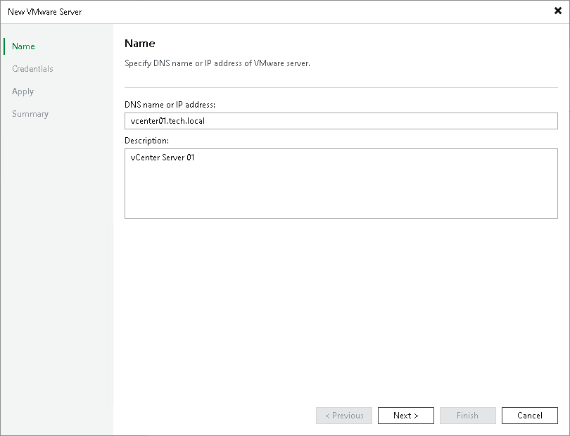

# Step 2. Specify Server Name or Address

In this article

At the Name step of the wizard, specify an address and description for the VMware vSphere server.

1. Enter a full DNS name, or IPv4 or IPv6 address of the vCenter Server or standalone ESXi host. Note that you can use IPv6 addresses only if IPv6 communication is enabled as described in section [IPv6 Support](ipv6.md).

If you add a VMware Cloud on AWS vCenter Server, use its Fully Qualified Domain Name (FQDN). Make sure the name you specify ends with <vmc.vmware.com>.

1. Provide a description for future reference. The default description contains information about the user who added the server, date and time when the server was added.

Page updated 8/25/2023

Page content applies to build 13.0.1.1071
