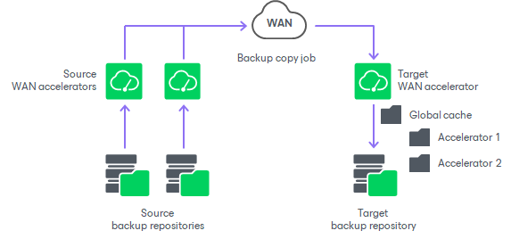

# Many to One WAN Acceleration

In this article

The WAN global cache can be used by several source WAN accelerators simultaneously. For example, if you have several remote/branch offices, you can configure several source WAN accelerators in remote sites and one target WAN accelerator in the head office.

In this case, the global cache will hold cache data for separate source WAN accelerators. The cache data for every source WAN accelerator will be stored in a dedicated subfolder in the global cache folder.

When one target WAN accelerator is used by several source WAN accelerators, Veeam Backup & Replication can copy data blocks between global cache of these WAN accelerators. This mechanism works if there are no matching backups of VMs in the target backup repository, but matching data is available in cache of other WAN accelerators.

For example, you have two backup copy jobs: Job 1 and Job 2. The Job 1 uses the source WAN accelerator Source 1 and the target WAN accelerator Target 3. The Job 2 uses the source WAN accelerator Source 2 and the same target WAN accelerator Target 3. In the global cache folder, Veeam Backup & Replication will store data for 2 WAN accelerators: Source 1 and Source 2.

* Job 1 processes a VM running Microsoft Windows Server 2008 R2, and it has been running for some time. In the global cache, there is already data for this type of OS.
* Job 2 also processes a VM running Microsoft Windows Server 2008 R2. When you start Job 2 for the first time, there is no data for this type of OS in the global cache for Source 2 WAN accelerator. In such situation, Veeam Backup & Replication will copy the necessary data block from the Source 1 cache to the Source 2 cache and will not transport this data block over WAN.

|  |
| --- |
| Note |
| Beside using global cache of other WAN accelerator, Veeam Backup & Replication also utilizes backup files residing in the backup repository. For example, if the backup repository contains a backup file created by a backup job and the backup copy job starts copying a backup of a VM of the same type, Veeam Backup & Replication will populate global cache on the WAN accelerator from the backup file not to transfer redundant data over WAN. |

Page updated 5/29/2024

Page content applies to build 13.0.1.1071
