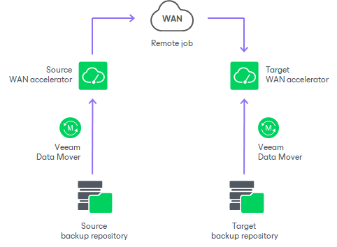

# WAN Accelerators

WAN accelerators are dedicated components that Veeam Backup & Replication uses for [WAN acceleration](wan_acceleration.md). WAN accelerators are responsible for global data caching and data deduplication.

Technically, WAN accelerators add a new layer in the backup infrastructure — between [Veeam Data Movers](veeam_transport_service.md) on the source side and the Veeam Data Mover on the target side.

WAN Accelerators Deployment

To enable WAN acceleration and data deduplication technologies, you must deploy a pair of WAN accelerators in your backup infrastructure.

* One WAN accelerator is deployed on the source site, closer to the source backup repository or source host.
* The other WAN accelerator is deployed on the target site, closer to the target backup repository or target host.

On each WAN accelerator Veeam Backup & Replication creates the VeeamWAN folder containing the following data:

* The VeeamWAN folder on the source WAN accelerator stores files with digests required for deduplication. For more information, see [How WAN Acceleration Works](wan_hiw.md).
* The VeeamWAN folder on the target WAN accelerator stores global cache data.

|  |
| --- |
| Note |
| Global cache is not used if both WAN accelerators in the pair (the source one and the target one) operate in the High bandwidth mode. |

To learn how to add a WAN accelerator to the Veeam Backup & Replication infrastructure, see [Adding WAN Accelerators](wan_add.md).

Recommendations for WAN Accelerators

You should not assign one source WAN accelerator to several jobs to remote locations that you plan to run simultaneously. The source WAN accelerator requires a lot of CPU and RAM resources, and does not process multiple tasks in parallel. As an alternative, you can create one job to the remote location for all VMs you plan to process over one source WAN accelerator.

The target WAN accelerator, however, can be assigned to several jobs to remote locations.

In This Section

* [WAN Global Cache](wan_global_cache.md)
* [WAN Accelerator Sizing](wan_accelerator_sizing.md)
* [Adding WAN Accelerators](wan_add.md)
* [Removing WAN Accelerators](wan_remove.md)
* [WAN Acceleration](wan_acceleration.md)

