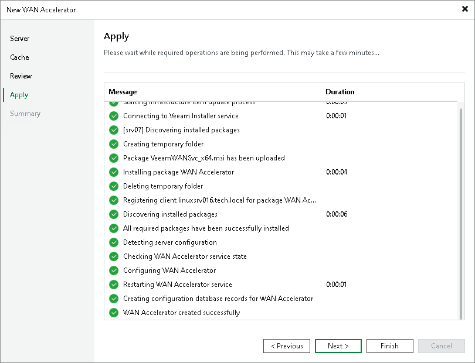

# Step 5. Apply WAN Accelerator Settings

In this article

At the Apply step of the wizard, wait till Veeam Backup & Replication installs and configures all required components. Click Next to complete the procedure of creating the WAN accelerator and adding it to the backup infrastructure.

Page updated 5/31/2023

Page content applies to build 13.0.1.1071
