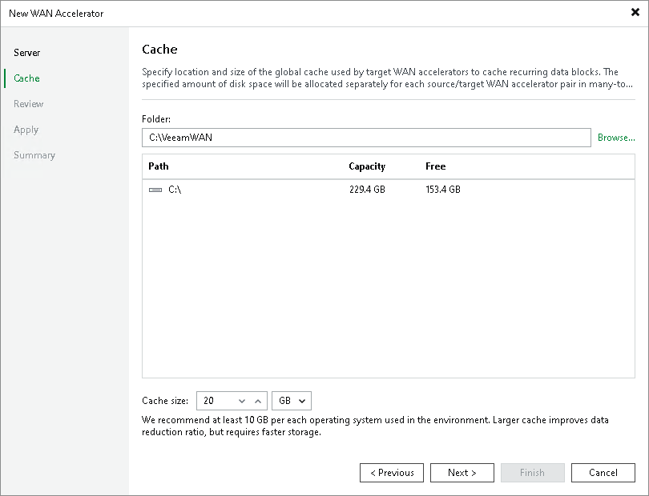

# Step 3. Define Cache Location and Size

In this article

At the Cache step of the wizard, define settings for the folder where service files and global cache data will be stored.

|  |
| --- |
| Note |
| If both WAN accelerators (the source one and the target one) work in the High bandwidth mode, WAN acceleration does not use the global cache. But note that you can disable the High bandwidth mode and switch back to the Low bandwidth mode at any time, which will require to use the global cache. To provide correct operation of WAN accelerators, we recommend that you allocate enough disk space for the global cache folder when adding a new WAN accelerator, no matter if the High bandwidth mode is enabled for it or not. |

1. In the Folder field, specify a path to the folder in which service files (for source and target WAN accelerators) and global cache data (for target WAN accelerator) must be stored. When selecting a folder on the target WAN accelerator, make sure that there is enough space for storing global cache data.
2. [For target WAN accelerator] In the Cache size field, specify the size for the global cache. The global cache size is specified per source WAN accelerator. If you plan to use one target WAN accelerator with several source WAN accelerators, the specified amount of space will be allocated to every source WAN accelerator and the size of the global cache will increase proportionally. For more information, see [WAN Accelerator Sizing](wan_accelerator_sizing.md).

|  |
| --- |
| Important |
| Do not nest the global cache folder deep in the file tree. During WAN acceleration operations, Veeam Backup & Replication generates service files with long file names. Placing such files to a folder of significant depth may cause problems on the NTFS file system. |

Page updated 1/2/2024

Page content applies to build 13.0.1.1071
