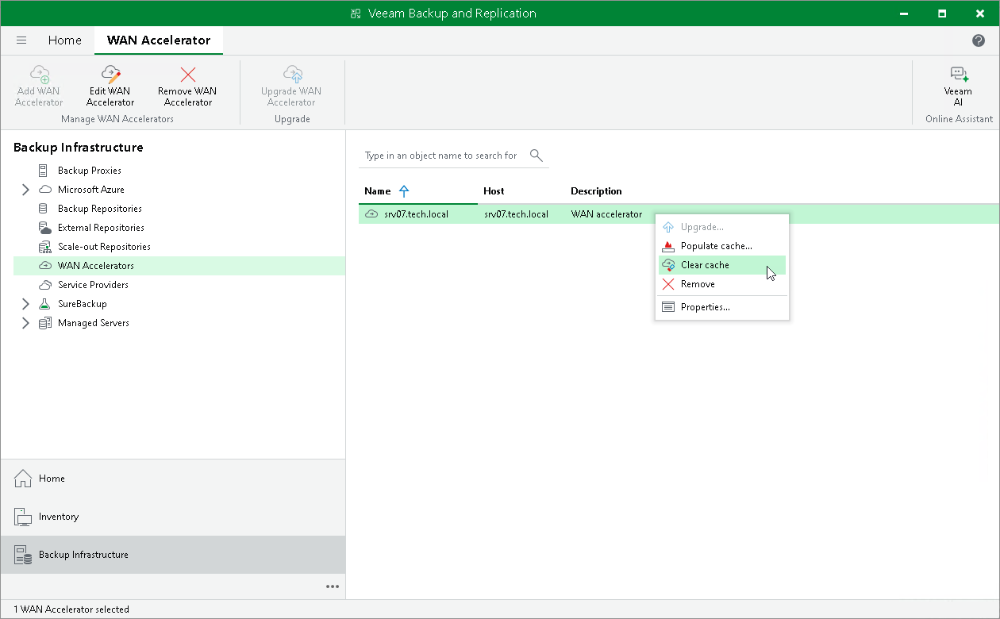

# Clearing Global Cache

In this article

You can clear the global cache on the target WAN accelerator. It is recommended that you clear the global cache in the following situations:

* Global cache is corrupted.
* Global cache contains data that is no longer needed. This situation may occur, for example, if you have decided to fully switch to the High bandwidth mode that does not use the global cache data.

In such cases, it is recommended that you clear the global cache and [populate it anew](wan_populate_cache.md) before you start jobs to remote locations processing new types of VMs.

To clear the global cache:

1. Open the Backup Infrastructure view.
2. In the inventory pane, click WAN Accelerators.
3. In the working area, right-click the target WAN accelerator and select Clear cache.

|  |
| --- |
| Important |
| Consider the following:   * Before you clear the global cache, make sure that you do not have any running jobs that use this target WAN accelerator. When the global cache is cleared, Veeam Backup & Replication will restart the Veeam WAN Accelerator Service, and running jobs will complete with the Failed status. * When you clear the global cache, you also clear all digest data stored at this WAN accelerator. |

Page updated 5/29/2024

Page content applies to build 13.0.1.1071
