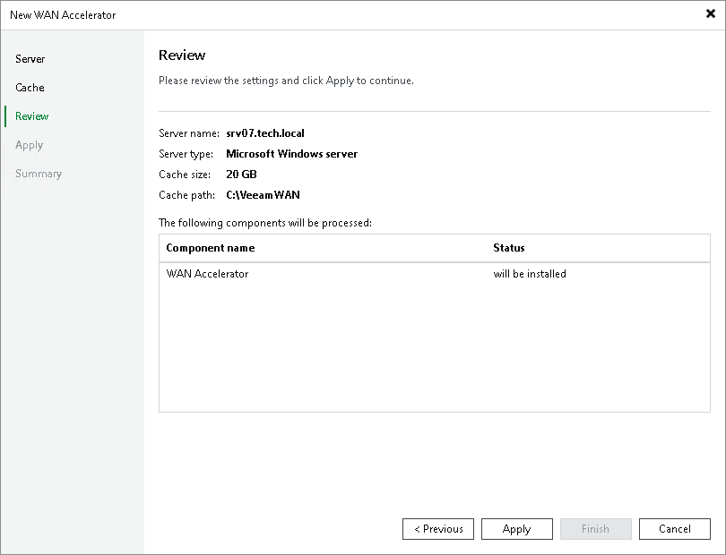

# Step 4. Review Components

In this article

Veeam Backup & Replication installs the following components on the server used as a WAN accelerator:

* Veeam Data Mover
* Veeam WAN Accelerator Service

At the Review step of the wizard, review what components are already installed on the server and what components will be installed.

1. Review the components.
2. Click Next to install the components on the server.

Page updated 1/25/2024

Page content applies to build 13.0.1.1071
