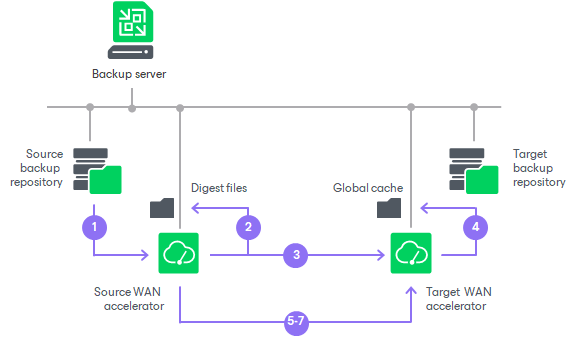

# How WAN Acceleration Works

In this article

When you create a job to the remote location, you can select to use WAN acceleration in its properties.

The procedure of data copying with WAN acceleration enabled is performed in the following way:

1. [For backup copy job] Veeam Backup & Replication decompresses the backup file to analyze its content.
2. The Veeam WAN Accelerator Service on the source WAN accelerator analyzes data blocks of the file to be transferred and creates a file with digests for these data blocks. The created file with digests is stored to the VeeamWAN folder on the source WAN accelerator.
3. Veeam Backup & Replication compresses the backup file data (for backup copy) or VM data (for replication) and copies it to the target side.

At this point, Veeam Backup & Replication can perform deduplication within the VM itself — that is, deduplicate identical data blocks in every VM disk.

1. During the data transfer process, the Veeam WAN Accelerator Service on the target WAN accelerator populates the global cache storage with data blocks from the copied file.
2. During the next job cycle, the Veeam WAN Accelerator Service on the source WAN accelerator analyzes data blocks in the file that must be transferred this time and creates digests for these data blocks.
3. The Veeam WAN Accelerator Service compares the created digests with the digests that have been previously stored to the VeeamWAN folder on the source WAN accelerator. If duplicate data blocks are found, the actual data block in the backup file is not copied over WAN. Instead, it is taken from the global cache and written to the restore point in the backup copy folder or on the target data volume.
4. Additionally, Veeam Backup & Replication analyzes restore points that have been previously copied to the target side. If duplicates are found, Veeam Backup & Replication does not copy such blocks over WAN but takes them from the previously copied restore points.

As a result, Veeam Backup & Replication copies only new data blocks to the target side and uses data blocks that are already stored in the global cache or in restore points in the target backup repository.

If the target WAN accelerator is used by several jobs, the target backup repository may already contain data blocks of the necessary VM type. In this situation, Veeam Backup & Replication will copy the required data blocks to the global cache before the copying process starts and use these data blocks further on. For more information, see [Many to One WAN Acceleration](wan_acceleration_many.md).

If WAN acceleration is performed in the High bandwidth mode, the procedure of data transfer with WAN acceleration has the following peculiarities:

* Global cache is not used. Thus, the target WAN accelerator does not need extra disk space to store the global cache folder.
* Deduplication is performed only by using previous restore points for the processed VM on the target repository. Therefore, Veeam Backup & Replication performs less deduplication operations and saves resources and time for data processing.
* The data chunk size used by the Changed Block Tracking mechanism during deduplication is smaller if compared with the Low bandwidth mode. This reduces the size of redundant data to transfer.

Page updated 5/29/2024

Page content applies to build 13.0.1.1071
