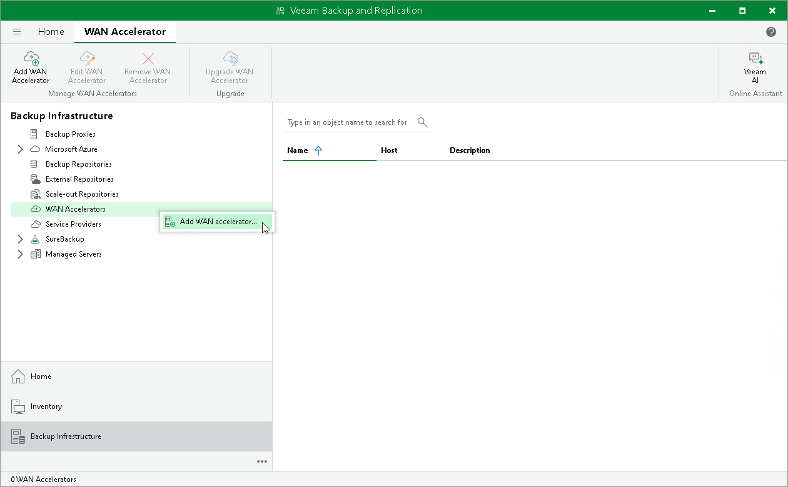

# Step 1. Launch New WAN Accelerator Wizard

In this article

To launch the New WAN Accelerator wizard, do either of the following:

* Open the Backup Infrastructure view, in the inventory pane select WAN Accelerators and click Add WAN Accelerator on the ribbon.
* Open the Backup Infrastructure view, in the inventory pane right-click WAN Accelerators and select Add WAN Accelerator.

Page updated 2/23/2024

Page content applies to build 13.0.1.1071
