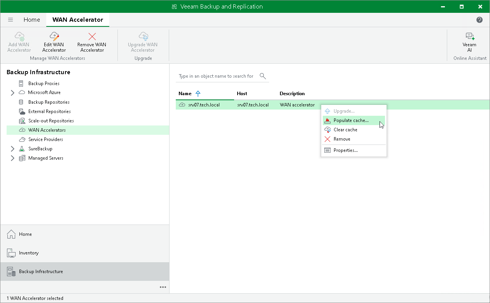

# Manually Populating Global Cache

In this article

To manually populate the global cache:

1. Open the Backup Infrastructure view.
2. In the inventory pane, select the WAN Accelerators node.
3. In the working area, right-click the target WAN accelerator and select Populate cache.

If the selected WAN accelerator is not assigned as a target WAN accelerator to any job to the remote location, Veeam Backup & Replication will display a warning.

1. In the Source Backup Repositories window, select backup repositories from which OS data blocks must be retrieved.

It is strongly recommended that you select backup repositories on the same site where the target WAN accelerator is located. In the opposite case, the traffic will travel between sites, which will increase load on the network.

1. Click OK.

Related Topics

[Manual Population of Global Cache](wan_population.md)

Page updated 7/18/2024

Page content applies to build 13.0.1.1071
