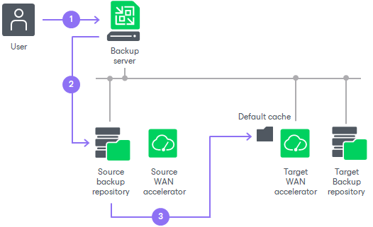
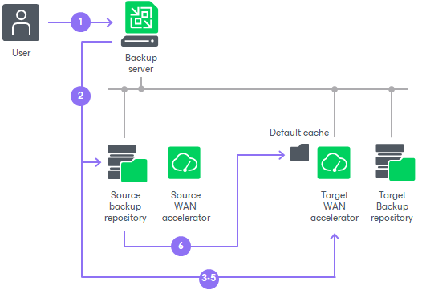

# Manual Population of Global Cache

In this article

You can manually pre-populate the global cache to avoid the situation where the cache remains empty. As a result, by the time a job to the remote location starts, the global cache will contain data blocks that can be used for data deduplication.

Manual population of the global cache can be helpful in the following scenarios:

* First run of a job to the remote location. When you run a first session of a job to the remote location, the global cache is empty, and the whole amount of VM data needs to be transferred over WAN. It is recommended that you manually populate the global cache before you start a job to the remote location for the first time.
* Global cache corruption. If the global cache gets corrupted for some reason, Veeam Backup & Replication needs to perform at least one session of the job to the remote location to replace corrupted data blocks with valid data blocks. In this situation, you can clean the global cache and manually populate it with valid data before the job to the remote location begins.

|  |
| --- |
| Important |
| Veeam Backup & Replication does not use encrypted backups for manual global cache population. |

Limitations for Manual Population of Global Cache

The manually performed global cache population task has the following limitations:

* Veeam Backup & Replication does not use encrypted backups for global cache population.
* Veeam Backup & Replication writes only data blocks for Windows-based OSes to the default cache. Data blocks for other OSes like Linux/Unix and application data blocks are not written to the cache.
* You can start the global cache population task for the target WAN accelerator that is not currently used by any job to the remote location.
* If the global cache population task is currently running, the target WAN accelerator is locked. You cannot start any job to the remote location by using this target WAN accelerator.
* [For global cache corruption scenario] You must clean the global cache before you populate it with valid data.
* [Veeam Cloud Connect] Veeam Backup & Replication does not use tenant backups to populate global cache on the service provider side.

How Manual Population of Global Cache Works

Global cache population is a manual operation performed by the user. When you run the global cache population task, Veeam Backup & Replication creates a ‘default cache’ on the target WAN accelerator. The default cache is used as a basic, universal cache for every new job to the remote location.

To populate the default cache, Veeam Backup & Replication uses backup files stored in backup repositories as a source of data.

The procedure of global cache population includes the following steps:

1. The user manually starts the global cache population tasks and selects backup repositories from which data blocks should be retrieved.
2. Veeam Backup & Replication scans backup repositories and makes up a list of OSes whose data blocks are available in backup files.
3. Veeam Backup & Replication copies data blocks from backup repositories and populates the default cache with these data blocks.

When a job to the remote location starts, Veeam Backup & Replication renames the default cache to a folder for the source WAN accelerator engaged in the job. As a result, Veeam Backup & Replication can use data blocks in this folder for deduplication starting from the very first session of the job to the remote location.

In many-to-one WAN accelerator deployment scenarios, the global cache may have folders for other source WAN accelerators, and these folders may contain data blocks for some OSes. If the global cache already contains some data, the procedure of global cache population includes the following steps:

1. The user manually starts the global cache population tasks and selects backup repositories from which data blocks should be retrieved.
2. Veeam Backup & Replication scans backup repositories and makes up a list of OSes whose data blocks are available in backup files.
3. Veeam Backup & Replication scans folders for other source WAN accelerators in the global cache and makes up a list of OSes whose data blocks are available there.
4. The list of OSes in the global cache is compared to the list of OSes in backup repositories. This way, Veeam Backup & Replication detects data blocks for which OSes are missing in the global cache.
5. In the global cache, Veeam Backup & Replication detects a folder with the maximum amount of data. This folder is used as a basis for the default cache.
6. Veeam Backup & Replication copies data blocks only for missing OSes from backup repositories and populates the default cache with these blocks. Data blocks for OSes available in folders for other source WAN accelerators are not copied to the default cache during the population task. Veeam Backup & Replication copies these data blocks on the fly, when a job to the remote location runs. For more information, see [Many to One WAN Acceleration](wan_acceleration_many.md).

Related Topics

* [Manually Populating Global Cache](wan_populate_cache.md)
* [Clearing Global Cache](wan_clear_cache.md)

Page updated 6/8/2023

Page content applies to build 13.0.1.1071
