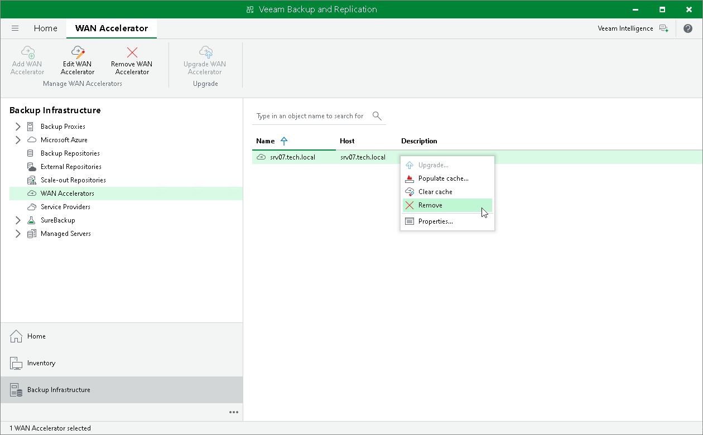

# Removing WAN Accelerators

In this article

You can permanently remove a WAN accelerator from the backup infrastructure. When you remove a WAN accelerator, Veeam Backup & Replication unassigns the WAN accelerator role from the server, and this server is no longer used as a WAN accelerator. The server itself remains in the backup infrastructure.

To remove a WAN accelerator:

1. Open the Backup Infrastructure view.
2. In the inventory pane, select WAN accelerators.
3. In the working area, select the WAN accelerator and click Remove WAN Accelerator on the ribbon or right-click the WAN accelerator and select Remove.

Page updated 5/31/2023

Page content applies to build 13.0.1.1071
