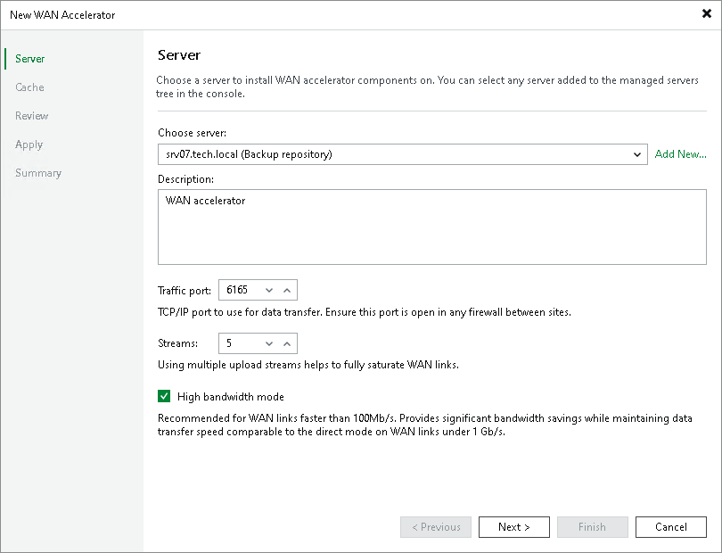

# Step 2. Choose Server

In this article

At the Server step of the wizard, select a server that you plan to use as a WAN accelerator and define port and connection settings for this server.

1. From the Choose server list, select a server added to the backup infrastructure. If the server is not added to the backup infrastructure yet, you can click Add New and select Microsoft Windows or Linux to add a new managed server. For more information, see [Adding Microsoft Windows Servers](add_windows_server.md) and [Adding Linux Servers](add_linux_server.md).
2. In the Description field, provide a description for future reference.

It is recommended that you describe the added WAN accelerator as the source or target one. When you create a job to the remote location, this hint will be displayed in brackets next to the WAN accelerator name, which will help you choose the necessary WAN accelerator to be used on the source or target side.

1. In the Traffic port field, specify the number of the port over which WAN accelerators must communicate with each other. By default, port 6165 is used.
2. In the Streams field, specify the number of connections that must be used to transmit data between WAN accelerators. By default, 5 connections are used.

This setting applies only to the source WAN accelerator. The greater is the number of streams, the more bandwidth resources Veeam Backup & Replication will use. A great number of streams engage more CPU and memory resources of the source WAN accelerator.

If the link has low latency and high bandwidth, the default setting (5 streams) may be enough to fully saturate it. If the link is still not saturated, the number of streams may be increased. Tests show that with high latency links, link speed x1.5 is a good best practice for estimating the number of streams required. The following example shows benchmark on a 10 Mbit/s WAN link with 100 milliseconds of latency.

| Link (Mbit/s) | Latency (ms) | Packet Loss | Streams | Throughput (Mbps) |
| --- | --- | --- | --- | --- |
| 10 | 100 | 0 | 3 | 3.5 |
| 10 | 100 | 0 | 10 | 7.5 |
| 10 | 100 | 0 | 15 | 10 |
| 10 | 100 | 0 | 20 | 10 |

Increasing the number of streams to more than required for fully saturating the link will slow down data transfers, as the data transfer will wait for all streams to initialize and stabilize before starting to transfer any data.

|  |
| --- |
| Tip |
| To test different scenarios in the lab before deploying WAN acceleration, you can use a WAN emulator (such as [WANem](https://wanem.sourceforge.net/)). |

1. If your network bandwidth is more than 100 Mbps, we recommend that you select the High bandwidth mode check box. The High bandwidth mode provides significant bandwidth savings comparable to the direct mode on WAN links under 1 Gbps.

To use the High bandwidth mode, enable the option for WAN accelerators at both sites of the data transfer: the source one and the target one. If the High bandwidth mode is enabled for the target WAN accelerator, different source accelerators can parallelly interact with it in different modes, depending on the mode selected for each source WAN accelerator.

When you enable the High bandwidth mode for an existing pair of WAN accelerators, Veeam Backup & Replication does not automatically remove the global cache that was previously used for acceleration. If you are planning to use only the High bandwidth mode for WAN acceleration and you do not need the global cache anymore, you can free the disk space by [manually removing the cache](wan_clear_cache.md). If you are planning to use WAN acceleration in the Low bandwidth mode in the future, we recommend that you keep the global cache. You can disable the High bandwidth mode at any time.

Page updated 9/23/2025

Page content applies to build 13.0.1.1071
