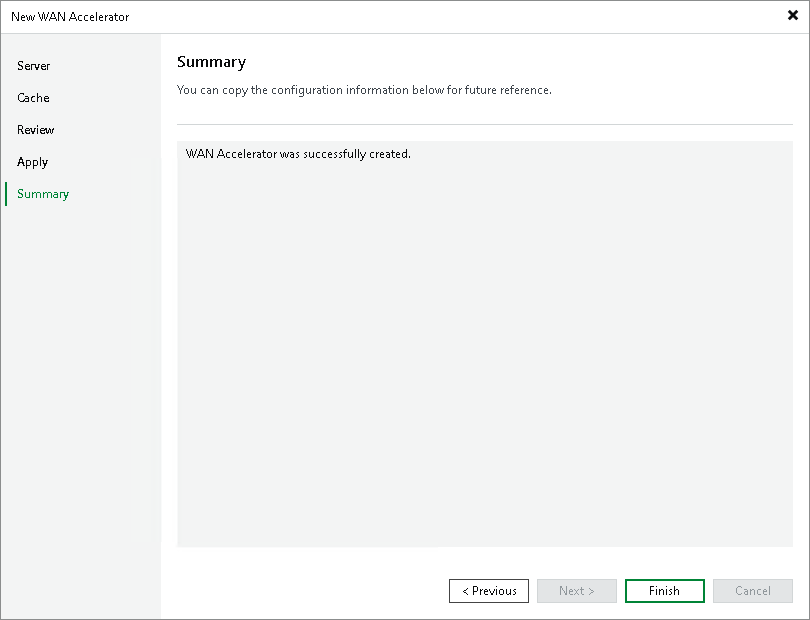

# Step 6. Finish Working with Wizard

In this article

At the Summary step of the wizard, review details of the added WAN accelerator and click Finish to exit the wizard.

Page updated 5/29/2024

Page content applies to build 13.0.1.1071
