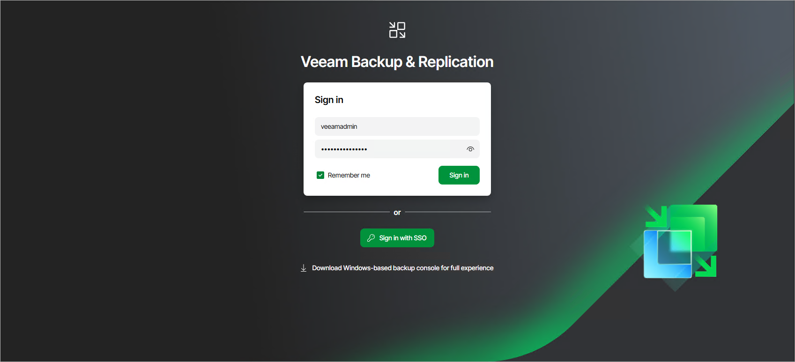

# Logging in to Veeam Backup & Replication Web UI

To access the Veeam Backup & Replication web UI, complete the following steps:

1. On your workstation or device, open any modern web browser.
2. In the browser address bar, enter the following URL, replacing <VBR-Host-Name> with the hostname or IP address of your Veeam Backup & Replication server:

|  |
| --- |
| https://<VBR-Host-Name>:443 |

|  |
| --- |
| Tip |
| If you are accessing the web UI from a remote location, ensure that your network, firewall, and DNS settings allow connectivity to the backup server over port 443. |

1. Accept the security certificate warning.

If your backup server uses a self-signed SSL certificate, your browser may display a security warning.

1. Review the warning details.
2. Proceed to accept the certificate and continue to the web UI page.

1. On the sign-in page, enter your Veeam Backup & Replication username and password.

Select Remember me to skip entering your credentials the next time you log in from the same device and browser.

If SAML authentication is enabled, click Sign in with SSO and specify credentials to log in to the SSO service used by your organization. For more information, see [SAML Authentication](identity_provider.md).

1. Click Sign In to access the web console.

Alternatively, you can use the Sign in as current user option. It allows you to log in to the Veeam Backup & Replication console using the credentials of the Windows user account currently signed in on the machine where you are launching the Veeam Backup & Replication console.

