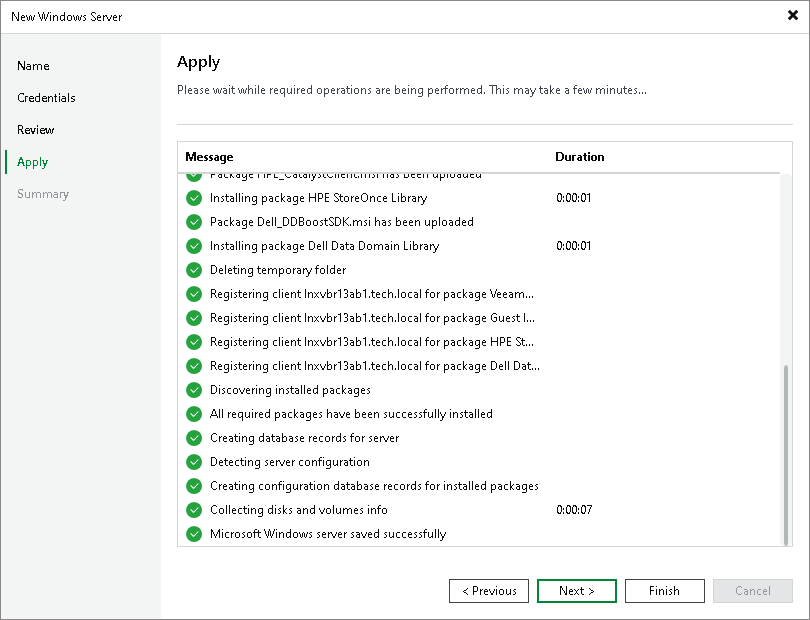

# Step 5. Apply Settings

At the Apply step of the wizard, wait till Veeam Backup & Replication installs and configures all the required components. Click Next to complete the adding of the server.

