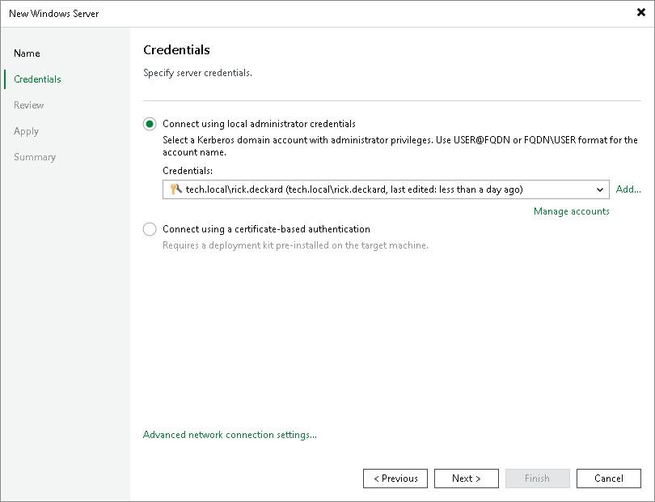

# Step 3. Specify Credentials

At the Credentials step of the wizard, specify authentication settings for the Microsoft Windows server.

1. Select one of the two authentication methods:

* Connect using local administrator credentials — this method uses the standard Windows Kerberos authentication protocol. It is recommended for environments with Active Directory or where traditional authentication is required. For more information, see [Kerberos Authentication](kerberos_authentication.md).

From the Credentials list, select credentials for the account that has administrator privileges described in section [Permissions](required_permissions.md#rphost). If you have not set up credentials beforehand, click the Manage accounts link or click Add on the right to add the credentials. For more information, see [Credentials Manager](credentials_manager.md).

Veeam Backup & Replication will use the provided credentials to deploy its components on the added server.

* Connect using a certificate-based authentication — select this option if you have pre-installed the Veeam Deployment Kit on the target server. With this method, no user name or password is required; authentication is performed using certificates. It is recommended for environments where Kerberos is disabled or unavailable, or for enhanced security. For more information, see [Using Veeam Deployment Kit](deployment_kit.md).

To use this option, ensure the Veeam Deployment Kit has been installed on the target Microsoft Windows server.

1. To customize network ports used by Veeam Backup & Replication components, click Advanced network connection settings. For default ports used by the Veeam Backup & Replication components, see [Ports](used_ports.md).

If necessary, adjust the port numbers.

1. In the Data transfer options section of the Network Settings window, specify connection settings for file copy operations. Provide a range of ports that will be used as transmission channels between the source server and target server (one port per task). By default, Veeam Backup & Replication uses port range 2500-3300.

If the virtual environment is not large and data traffic will not be significant, you can specify a smaller range of ports, for example, 2500-2509 to run 10 concurrent tasks at the same time. Note that Veeam Backup & Replication processes each VM disk as a separate task.

1. [For Microsoft Windows server deployed outside NAT] In the Preferred TCP connection role section select the Run server on this side check box. In the NAT scenario, the outside client cannot initiate a connection to the server on the NAT network. As a result, services that require initiation of the connection from outside can be disrupted. With this option selected, you will be able to overcome this limitation and initiate a "client-server" connection — that is, a connection in the direction of the Microsoft Windows server.

The option applies if one of the following roles is assigned to the server: source VMware backup proxy in backup or replication scenarios, source repository in the backup copy scenario.

