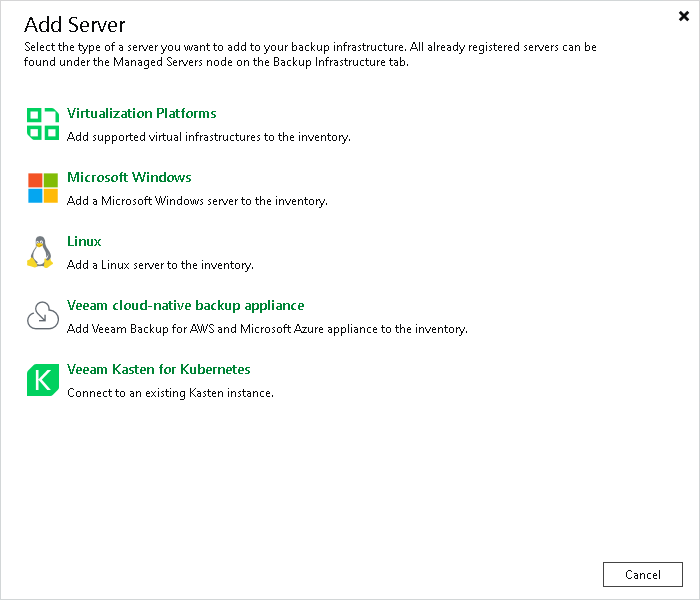

# Step 1. Launch New Windows Server Wizard

To launch the New Windows Server wizard, do one of the following:

* Open the Files view, in the [inventory pane](vbr_ui.md) select the Microsoft Windows node and click Add Server on the ribbon or right-click the Microsoft Windows node and select Add Server.
* Open the Backup Infrastructure view. In the [inventory pane](vbr_ui.md), select the Managed Servers node and click Add Server on the ribbon or right-click the Managed Servers node and select Add Server. In the Add Server window, select Microsoft Windows.

