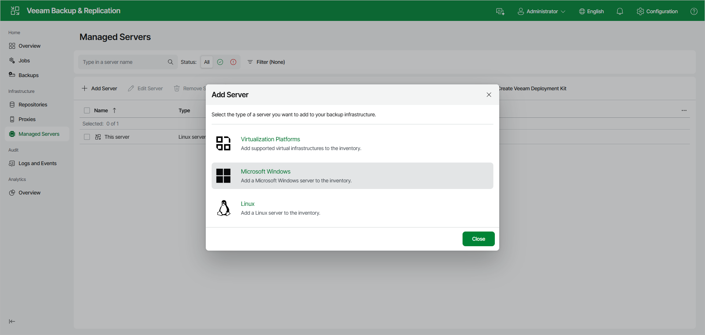

# Step 1. Launch New Windows Server Wizard

To launch the New Windows Server wizard, do the following:

1. Open the Managed Servers node in the management pane.
2. Click Add Server on the ribbon and select Microsoft Windows.

