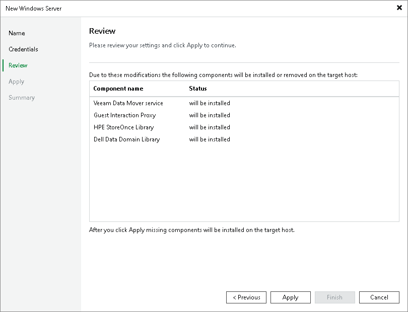

# Step 4. Review Components

In this article

At the Review step of the wizard, review what Veeam Backup & Replication components are already installed on the server and what components will be installed.

1. Review the components.
2. Click Apply to add the Microsoft Windows server to the backup infrastructure.

Page updated 1/25/2024

Page content applies to build 13.0.1.1071
