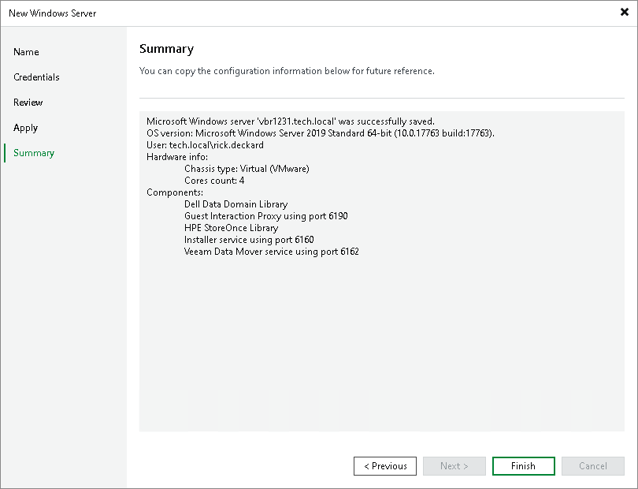

# Step 6. Finish Working with Wizard

At the Summary step of the wizard, complete the procedure of Microsoft Windows server adding.

1. Review details of the Microsoft Windows server.
2. Click Next, then click Finish to exit the wizard.

