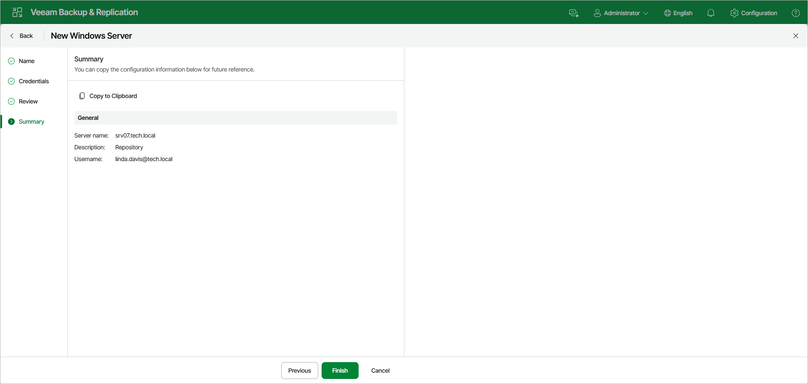

# Step 5. Finish Working with Wizard

At the Summary step of the wizard, review details of the Microsoft Windows server. Then click Finish to complete the procedure of adding the Microsoft Windows server to the backup infrastructure. Veeam Backup & Replication will install and configure all required components.

