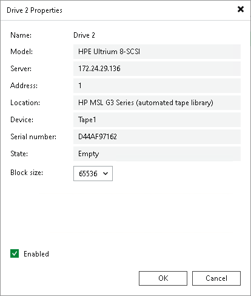

# Tape Drives

In this article

Drives of each connected library or standalone tape device are displayed in the Tape Infrastructure view under the Libraries > LibraryName node > Drives.

To view the drives properties, select Drives under the needed library. View the list and a short description of the drives in the working area. To view detailed information on a drive or to change its settings, click Properties on the ribbon. You can also right-click the necessary drive in the working area and select Properties.

To set block size for the drive manually, select a value from the Block size list in the drive properties.

|  |
| --- |
| Note |
| Veeam Backup & Replication uses uniform block size. Drive that is set manually to a particular block size may fail to read tape that was written with another block size. For more information on tape block size, see [Supported Devices and Configuration](tape_supported_devices.md). |

To disable a drive, clear the Enabled check box in the drive properties. To set the drive into working mode again, select the Enabled check boxs. You can disable a drive, for example, for maintenance. When you disable a drive, the library does not use this drive for read/write operations. If the library has multiple drives, other drives will be used for the read/write operations.

Page updated 6/14/2024

Page content applies to build 13.0.1.1071
