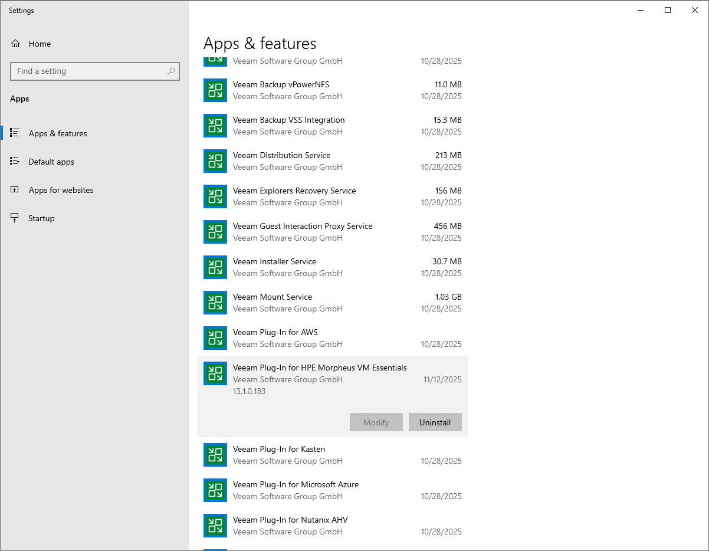

# Getting Technical Support

If you have any questions or issues with Veeam Plug-in for Xen, you can search for a resolution on [Veeam R&D Forums](https://forums.veeam.com/) or submit a support case in the [Veeam Customer Support Portal](https://www.veeam.com/support.html).

When you submit a support case, it is recommended that you provide the Veeam Customer Support Team with the following information:

* [Version information for the product and its infrastructure components](#ViewingProductDetails)
* The error message or an accurate description of the problem you are facing
* [Log files](#DownloadingLogs)

Viewing Product Details

To view the product details in a Windows-based environment, do the following:

1. On the server running the Veeam Backup & Replication console, navigate to Settings > Apps & features.

Alternatively, open the Control Panel window and navigate to Programs > Programs and Features.

1. In the program list, check the version of Veeam Plug-in for Xen.

To view the product details in a Linux-based environment, follow the instructions provided in section [Performing Maintenance Tasks](hmc_perform_maintenance_tasks.md).

Downloading Logs

To download the product logs in a Windows-based environment, do the following:

1. From the main menu of the Veeam Backup & Replication console, select Help > Support Information.
2. At the Scope step of the Export Logs wizard, select the Export all logs for selected components option. Then, in the Managed servers list, select the backup server.

Complete the wizard as described in the Veeam Backup & Replication User Guide, section [Exporting Logs](exporting_logs.md).

To download the product logs in a Linux-based environment, follow the instructions provided in section [Downloading Logs](hmc_perform_maintenance_tasks.md).

Page updated 2026-07-22

