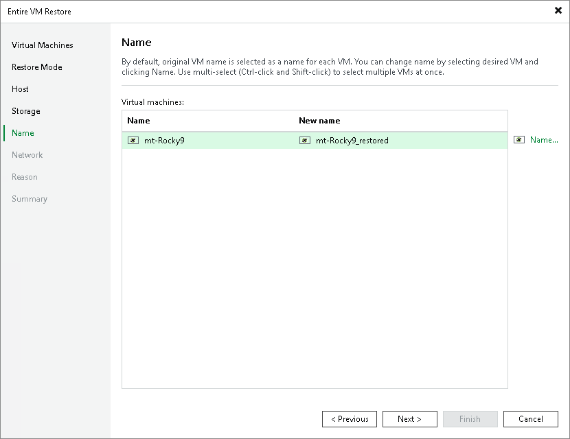

# Step 6. Specify VM Name

At the Name step of the wizard, you can specify a new name for the recovered VM. The maximum length of the name is 63 characters; only the following characters are supported: a-z, A-Z, 0-9, -. The hyphen-minus character (-) is supported, but you cannot use it as the first or the last character of the name.

|  |
| --- |
| Tip |
| On the Name step, you can also assign a new prefix and postfix to the recovered VM instead of providing a new name. |

Page updated 2026-07-08

