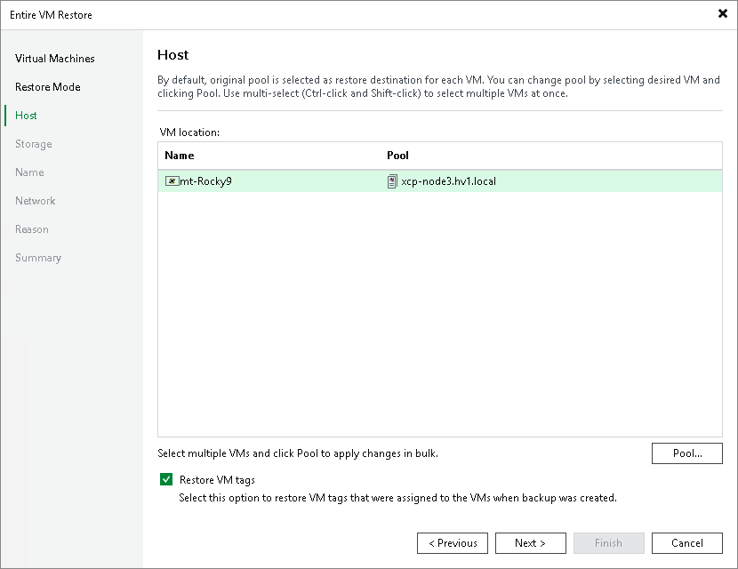

# Step 4. Specify Target Pool

[This step applies only if you have selected the Restore to a new location, or with different settings option at the Restore Mode step of the wizard]

At the Host step of the wizard, choose a pool to which the recovered VM will belong. For a pool to be displayed in the list of available pools, it must be added to the backup infrastructure as described in [Connecting Citrix XenServer pool](xen_server_connect.md).

|  |
| --- |
| Tip |
| You can also choose whether you want the recovered VM to be included into the same tag as the original VM. |

Page updated 2026-07-29

