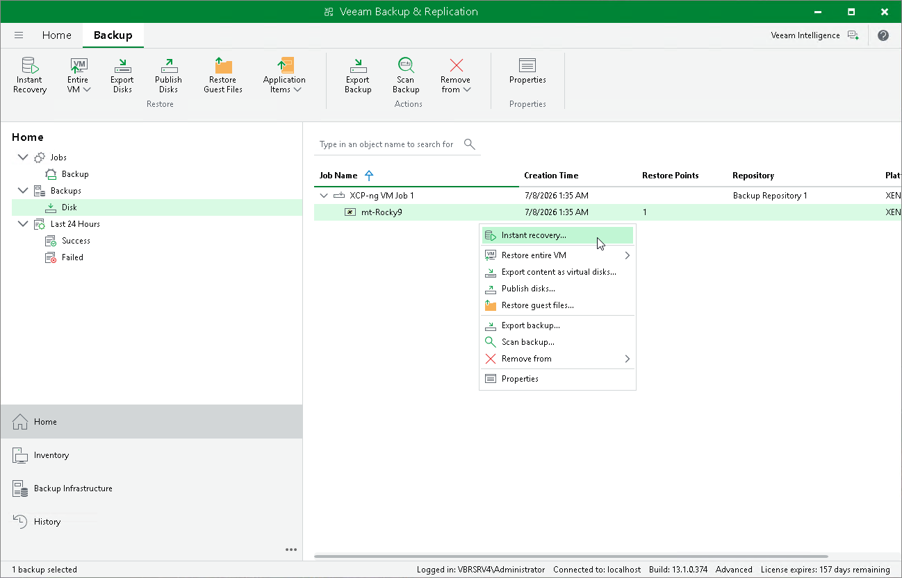

# Performing Instant VM Recovery

With Instant VM Recovery, you can immediately restore Xen VMs as VMware vSphere, Microsoft Hyper-V, Nutanix AHV or Proxmox VE VMs to your production environment by running them directly from their backups. Instant VM Recovery helps you improve recovery time objectives and minimize disruption and downtime of production workloads. For more information on Instant VM Recovery, see [VM Recovery](vm_restores.md).

To perform Instant VM Recovery, do the following:

1. Open the Home view.
2. In the inventory pane, select Backups.
3. In the working area, expand the necessary backup job, right-click the VM you want to restore and select Instant recovery.

Alternatively, expand the necessary backup job, select the VM and click Instant Recovery on the ribbon.

* To restore the VM to VMware vSphere, complete the Instant Recovery wizard as described in section [Performing Instant VM Recovery of Workloads to VMware vSphere VMs](performing_instant_recovery_vm.md).
* To restore the VM to Microsoft Hyper-V, complete the Instant Recovery wizard as described in section [Performing Instant VM Recovery of Workloads to Hyper-V VMs](performing_instant_recovery_hv_vm.md).
* To restore the VM to Nutanix AHV, complete the Instant Recovery wizard as described in section [Performing Instant VM Recovery of Workloads to Nutanix AHV](ahv_instant_recovery.md).
* To restore the VM to Proxmox VE, complete the Instant Recovery wizard as described in section [Performing Instant VM Recovery of Workloads to Proxmox VE](pve_instant_recovery_pve.md).

Page updated 2026-07-08

