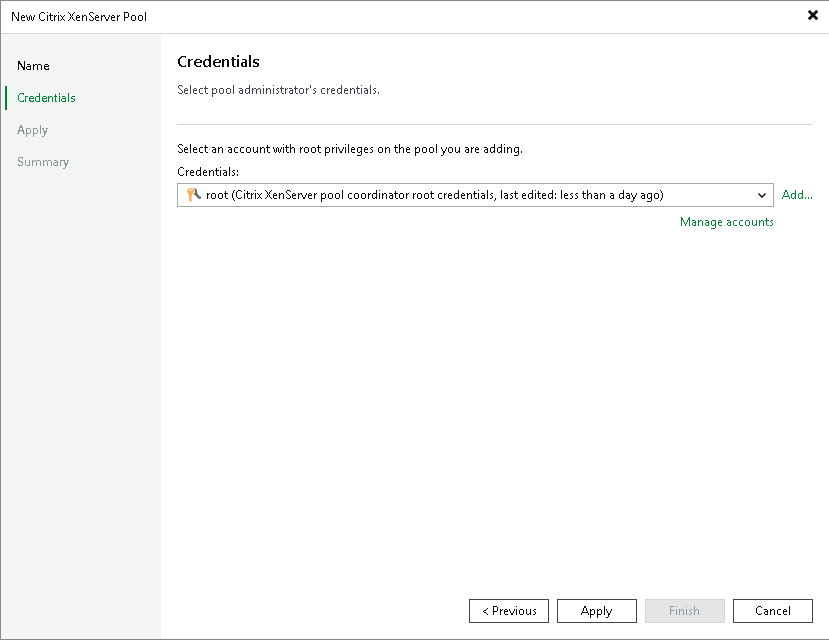

# Step 3. Enter Credentials

At the Credentials step of the wizard, specify credentials for an account with root privileges that will be used to access the Citrix XenServer pool coordinator.

For credentials to be displayed in the Credentials list, they must be added to the Credentials Manager as described in the Veeam Backup & Replication User Guide, section [Standard Accounts](credentials_manager_windows.md). If you have not added the necessary credentials to the Credentials Manager beforehand, you can do this without closing the New Citrix XenServer pool Pool wizard.

After you click Next, the backup server will connect to the Citrix XenServer pool pool and check its TLS certificate. If the certificate is not installed on the backup server, the Certificate Security Alert Window will display a warning notifying that secure communication cannot be guaranteed. To allow the backup server to connect to the Citrix XenServer pool pool using the certificate, click Continue.

Page updated 2026-07-21

