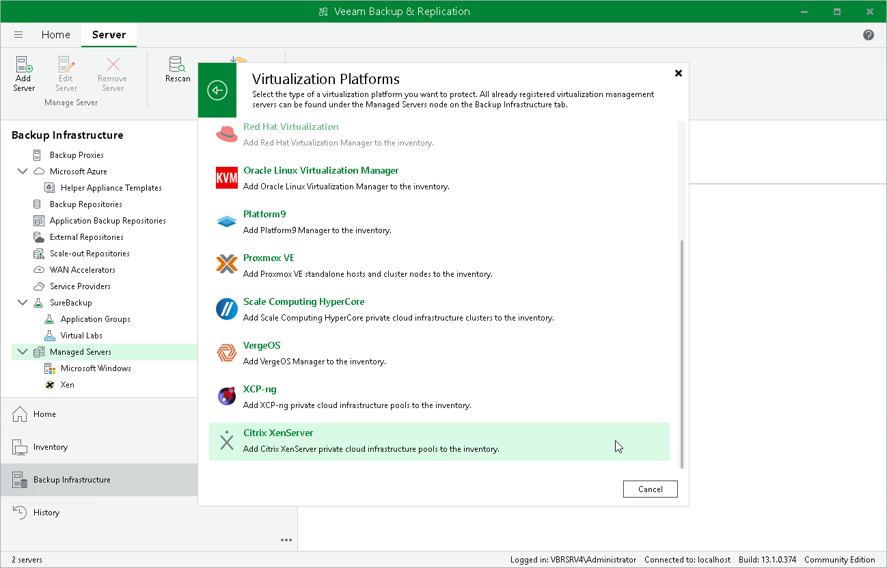

# Step 1. Launch New Citrix XenServer Pool Wizard

To launch the New Citrix XenServer Pool   wizard, do the following:

1. In the Veeam Backup & Replication console, open the Backup Infrastructure view.
2. In the inventory pane, select Managed Servers.
3. On the ribbon, click Add Server.
4. In the Add Server window, select Virtualization Platforms.
5. In the Virtualization Platforms window, select Citrix XenServer pool to launch the New Citrix XenServer pool Pool wizard.

Page updated 2026-07-21

