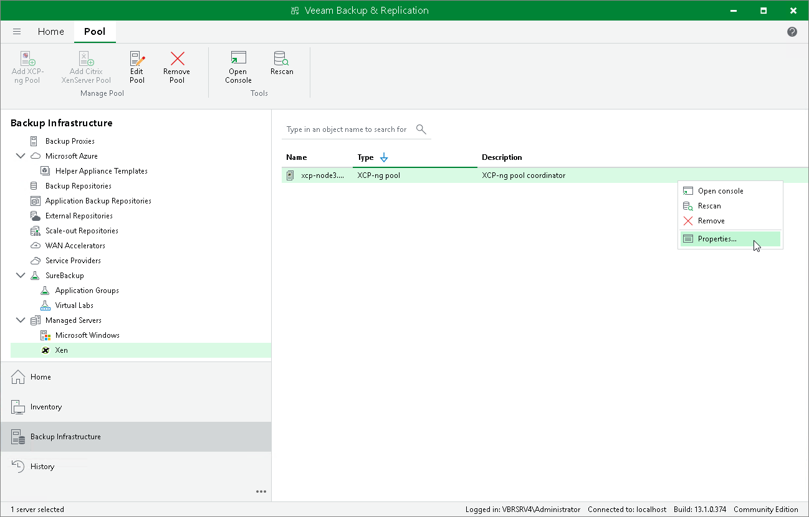

# Editing Xen Pool Properties

To edit properties of the Xen pool added to the backup infrastructure, do the following:

1. Open the Backup Infrastructure view.
2. In the inventory pane, select Managed Servers > Xen.
3. In the working area, select the Xen pool and click Edit Pool on the ribbon, or right-click the Xen pool and select Properties.
4. Complete the Edit Server wizard as described in sections [Adding XCP-ng Pool to Backup Infrastructure](xen_xcp_server_add.md) and [Adding Citrix XenServer Pool to Backup Infrastructure](xen_server_add.md).

Page updated 2026-07-22

