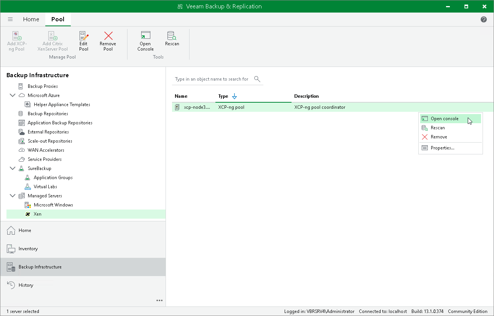

# Accessing Xen Pool Console

If you want to check the configuration of your Xen infrastructure, you can use Veeam Plug-in for Xen to launch the Xen console.

To access the Xen console:

1. Open the Backup Infrastructure view.
2. In the inventory pane, select Managed Servers > Xen.
3. In the working area, select the necessary pool and click Open Console on the ribbon.

Alternatively, right-click the pool and select Open console.

Page updated 2026-07-29

