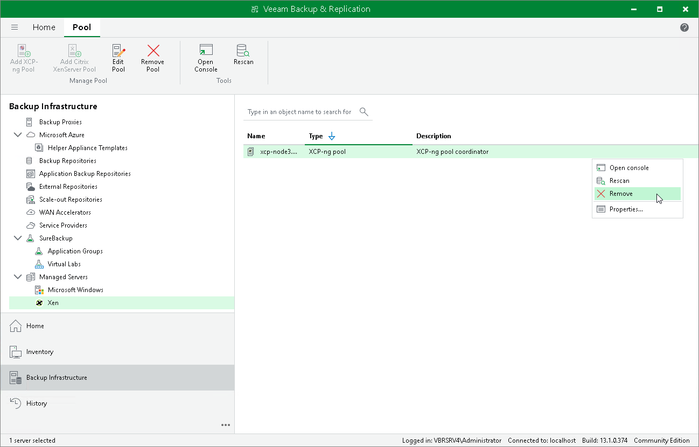

# Removing Xen Pool

If you do not want to protect resources managed by the connected Xen pool anymore, you can remove it from the backup infrastructure.

To remove the Xen pool from the backup infrastructure:

1. Open the Backup Infrastructure view.
2. In the inventory pane, select Managed Servers > Xen.
3. In the working area, select the Xen pool and click Remove Pool on the ribbon, or right-click the Xen pool and select Remove.

Page updated 2026-07-29

