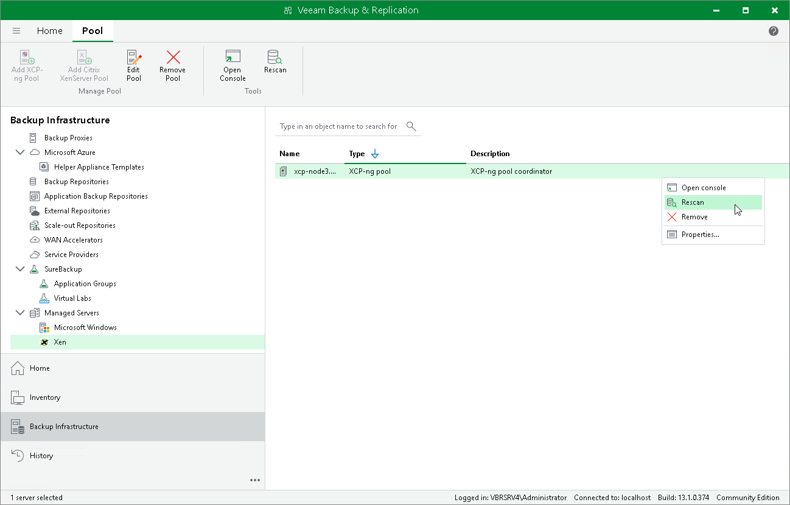

# Rescanning Xen Pool

Veeam Backup & Replication retrieves information about the Xen environment from the pool coordinator. However, the data synchronization process may take some time to complete. If you make any changes to the Xen environment and want the Veeam Backup & Replication console to display the changes immediately, you can rescan the pool coordinator manually.

To rescan the pool coordinator, do the following:

1. Open the Backup Infrastructure view.
2. In the inventory pane, select Managed Servers > Xen.
3. In the working area, select the pool coordinator and click Rescan on the ribbon, or right-click the pool coordinator and select Rescan.

Page updated 2026-07-09

