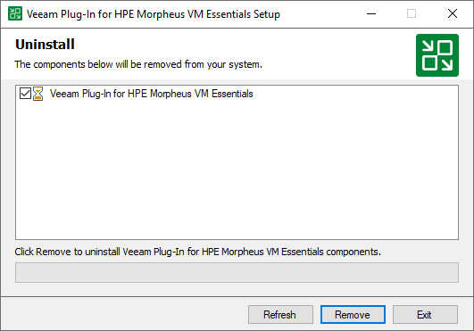

# Uninstalling Veeam Plug-In for Xen Manually

[This section applies only to Windows-based backup servers]

Before you uninstall Veeam Plug-in for Xen, it is recommended to [remove all configured workers](xen_workers_remove.md) from the backup infrastructure.

To uninstall Veeam Plug-in for Xen, do the following:

1. Log in to the backup server using an account with the Local Administrator permissions.
2. Open the Start menu and click the Settings icon.
3. In the Settings window, navigate to System > Apps and Features.
4. In the program list, select Veeam Plug-in for Xen. Then, click Uninstall.
5. In the opened window, click Remove.

Related Topics

* [Removing Xen Pool](xen_server_remove.md)
* [Removing Workers](xen_workers_remove.md)

Page updated 2026-07-22

