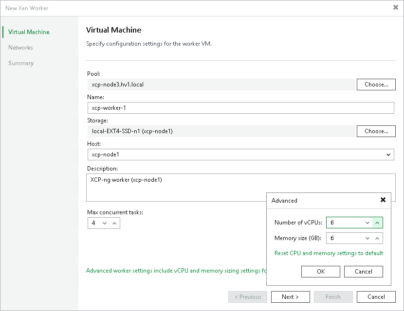

# Step 2. Specify Worker VM Settings

At the Virtual Machine step of the wizard, do the following:

1. Click Choose next to the Host field to specify a host where the worker will be launched.
2. In the Name field, specify a name for the worker. The maximum length of the name is 40 characters; the following characters are only supported: a-z, A-Z, 0-9, -.
3. Click Choose next to the Storage field to select storage where system files of the worker will be stored. For storage to be displayed in the list of available storage, it must be configured in the virtual environment as described in [Citrix XenServer documentation](https://docs.xenserver.com/en-us/xencenter/current-release/storage) and [XCP-ng documentation](https://docs.xcp-ng.org/storage/).
4. In the Worker description field, provide a description for future reference. The maximum length of the description is 1024 characters.
5. In the Max concurrent tasks field, specify the number of tasks that the worker will be able to handle in parallel. If this value is exceeded, the worker will not start processing a new task until one of the currently running tasks finishes.

The default number of concurrent tasks is set to 4. When you change this value, the wizard automatically adjusts the amount of resources that will be allocated to the worker. If you want to specify the amount of resources manually, click Advanced settings.

|  |
| --- |
| Note |
| When performing data protection and disaster recovery operations, Veeam Backup & Replication initiates a new task for each VM that is being processed. |

Page updated 2026-04-22

