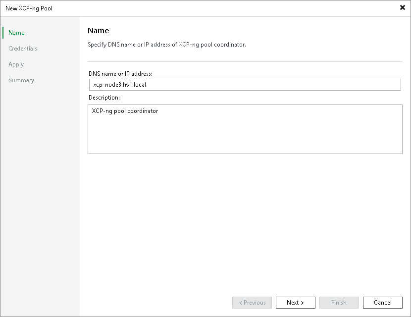

# Step 2. Specify Domain Name or IP Address of XCP-ng Pool Coordinator

At the Name step of the wizard, do the following:

1. In the DNS name or IP address field, enter the FQDN or IP address of the XCP-ng pool coordinator.
2. In the Description field, provide a description for future reference. The field already contains a default description with information about the user who added the pool coordinator, date and time when the pool coordinator was added.

Page updated 2026-07-29

